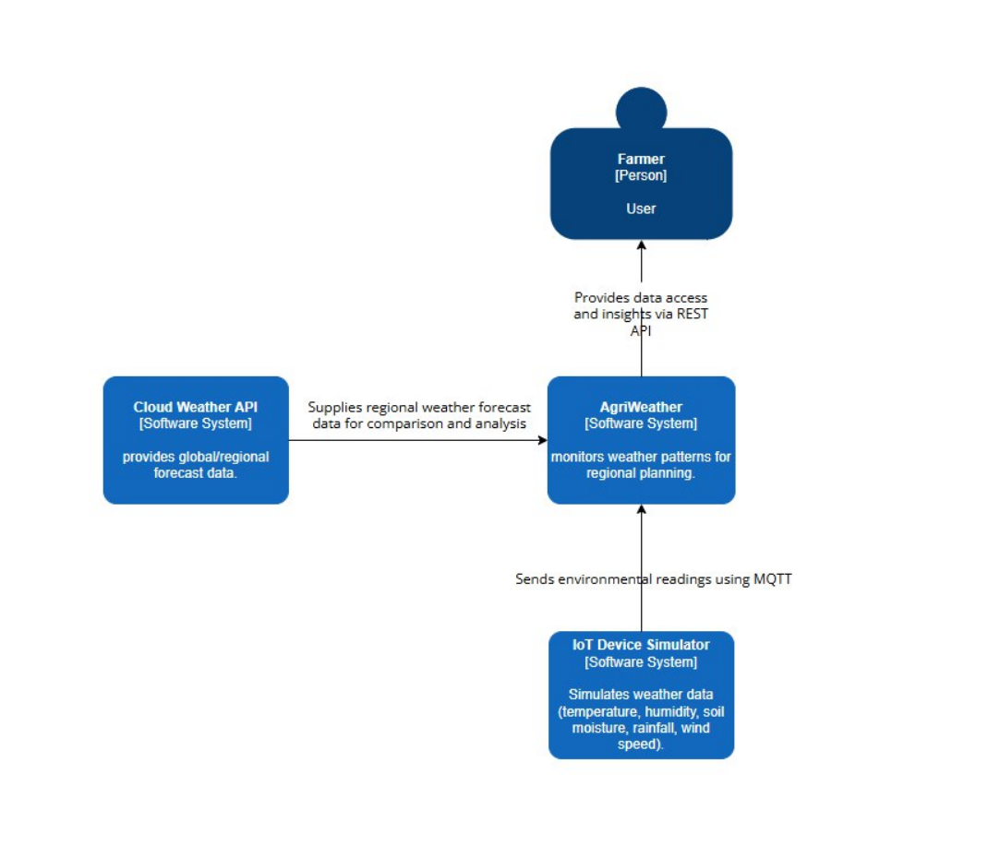
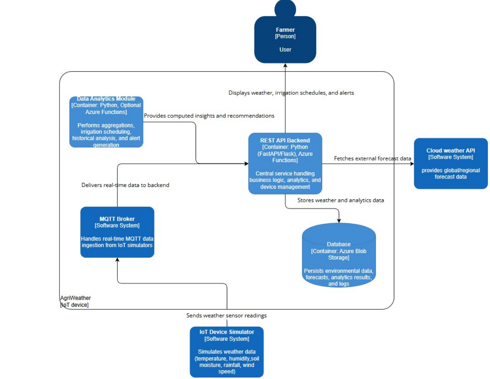

# AgriWeather IoT Platform

## Overview

AgriWeather is an IoT-based weather monitoring platform designed for agricultural applications. The platform enables farmers and agricultural professionals to make data-driven decisions about crop planning, irrigation scheduling, and farm management through real-time weather data collection and analysis.

## Project Components

This project is being developed as part of the IoT & Cloud Computing course and will include:

- **IoT Device Simulator**: Simulates weather sensors collecting environmental data (temperature, humidity, rainfall, soil moisture, wind speed)
- **Cloud Storage**: Azure Blob Storage for secure data storage
- **Backend REST API**: RESTful API for data access and business logic
- **CLI Interface**: Command-line interface for platform management and data access
- **Architecture**: C4 model diagrams
- **Cost Analysis**: Azure Pricing Calculator estimates
- **Postman Collection**: Complete API testing collection with example requests

## Architecture

### C4 Model Diagrams

#### System Context Diagram

The System Context diagram shows the high-level interaction between users (Farmers), the AgriWeather system, external weather APIs, and IoT device simulators.

#### Container Diagram

The Container diagram details the internal architecture including:
- IoT Device Simulator: Simulates weather sensor data
- MQTT Broker: Handles real-time data ingestion
- REST API Backend: Central service with business logic and analytics (FastAPI/Flask, Azure Functions)
- Database: Azure Blob Storage for persistence
- Cloud Weather API: External forecast data provider
- Data Analytics Module: Optional container for advanced analytics (Python, Azure Functions)

## Documentation

- [Business Context & User Stories](BUSINESS_CONTEXT.md) - Detailed use cases, user stories, and business requirements
- Installation Guide - Coming soon
- API Documentation - Coming soon

## Technology Stack

- **Cloud Platform**: Microsoft Azure
- **Storage**: Azure Blob Storage
- **Backend**: Python Flask/FastAPI (planned)
- **IoT Protocol**: MQTT (planned)
- **API**: RESTful API
- **CLI**: Python-based command-line interface
- **API Testing**: Postman

## Team

This project is being developed by a team as part of the IoT & Cloud Computing course.

## License

This project is licensed under the MIT License - see the [LICENSE](LICENSE) file for details.

## Project Status

🚧 **In Development** - Currently working on business requirements and architecture design

### Completed
- ✅ Business context and use case documentation
- ✅ User stories definition

### In Progress
- 🔄 Architecture design
- 🔄 Technology stack finalization

### Planned
- 📋 IoT device simulator implementation
- 📋 Cloud infrastructure setup (Azure)
- 📋 REST API development
- 📋 CLI interface development
- 📋 Postman collection creation
- 📋 Testing and documentation